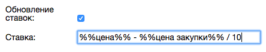

Ставки для ключевых фраз
========================

Плагин позволяет устанавливать ставки для ключевых фраз. Вы можете указать точную ставку, например 100, или указать формулу для расчета ставки.

Для того, чтобы плагин управлял ставками, вам необходимо просто поставить галку у поля "Обновление ставок".

В формуле для ставки можно использовать %%цена%% и %%цена закупки%%. Если в вашем объявлении используются характеристики
артикула, то цена и цена закупки будут браться из артикула.