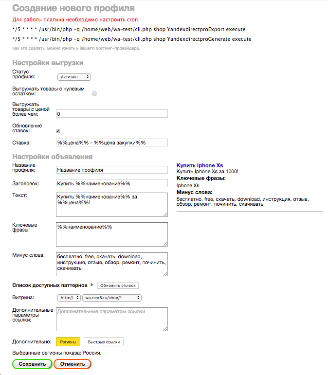

Настройки профиля
=================

.. csv-table:: Описание пунктов настроек профиля
    :header: "Наименование поля", "Описание", "Только для групп?"
    :widths: 15, 10, 30

    "Статус профиля", "Активен - объявления выгружаются. Остановлен - объявления удаляются.", "нет"
    "Выгружаемые товары", "Список товаров, на основании которых будут сгенерированы объявления.", "да"
    "Выгружать товары с нулевым остатком", "Нужно ли выгружать товары, у которых остаток равен нулю?", "нет"
    "Обновление ставок", "Нужно ли обновлять ставки для ключевых слов?", "нет"
    "Ставка", "Ключевая ставка, можно использовать паттерн %%цена закупки%%", "нет"
    "Выгружать товары с ценой более чем", "Будут выгружены товары, у которых цена больше указанной", "нет"
    "Название профиля", "Название профиля в магазине", "нет"
    "Заголовок", "Заголовок объявления в Яндекс.Директ", "нет"
    "Текст", "Текст объявления в Яндекс.Директ", "нет"
    "Ключевые фразы", "Ключевые фразы объявления в Яндекс.Директ. Указывать через запятую.", "нет"
    "Минус слова", "Минус слова объявления в Яндекс.Директ. Указывать через запятую.", "нет"
    "Список доступных паттернов", "Паттерны, которые можно использовать при создании объявлений", "нет"
    "Витрина", "Витрина, которая будет использоваться при генерации ссылок на товары", "нет"
    "Дополнительный параметры ссылки", "Здесь можно добавить параметры, которые будут добавлены к ссылке на товар после вопросительного знака", "нет"
    "Дополнительно", "Здесь выбираются регионы показа и устанавливаются быстрые ссылки", "нет"
