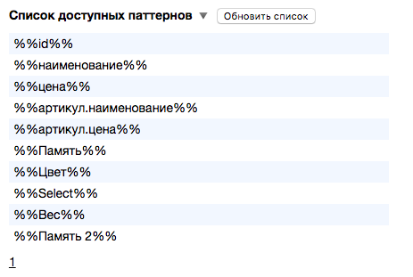

Что такое паттерны?
===================

Для того, чтобы понять что такое паттерны и зачем они нужны, давайте рассмотрим пример ниже.

Предположим, у вашего магазина тысяча товаров.
Мы хотим получить для каждого товара заголовок, например, такой "Купить iphone x за 60000р!".
Для этого мы должны 1000 раз написать заголовок, используя название каждого товара и его цену.
Представляете сколько времени и сил это займет? А что будет, если мы заходим снизить цены на все эти товары?

Вот для таких случаев мы и придумали паттерны. Паттерны - это характеристика товара, которая заключена с обеих сторон двойным знаком процента, например
%%наименование%% или %%цена%%. При помощи паттернов, мы можем создать 1000 объявлений, написав всего одну строчку: "Купить %%наименование%% за %%цена%%р!".
Также при изменении цен на товары, объявления автоматически обновят цену в заголовках.

Паттерны можно использовать в заголовке, тексте, ключевых фразах и минус-словах.

Список доступных паттернов находится в разделе "Список доступных паттернов".