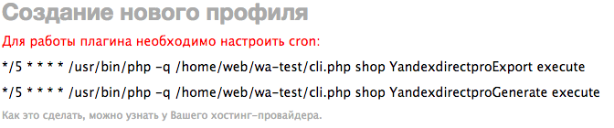

Настройка cron
==============

Для работы плагина необходимо настройть cron. В задания cron нужно добавить скрипты, указанные на странице создания нового профиля.

Если у вас возникли трудности с настройкой cron, то обратитесь в службу поддержки вашего хостера с просьбой помочь вам настроить cron.

Мы можем сделать это за вас, цена данной услуги составляет 1000р. Заранее убедитесь, что ваш хостер поддерживает cron, так как деньги возвращаются только если cron присутствует и мы не можем его настроить.